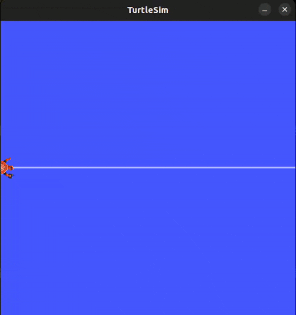

# Turtle Motion ROS2 Package

 

A ROS2 package for creating advanced turtle motion patterns in Turtlesim. Features sinusoidal/cosine waves, circular motion, wall bouncing, goal chasing, follower behavior, and real-time plotting.

# turtle_motion

A ROS 2 package for controlling and visualizing the motion of turtlesim turtles with a variety of motion behaviors and live plotting tools.

---

# Turtle Motion Demo




## Features

- **Go To Goal**: Move a turtle to a specified pose using proportional control ([`turtle_motion.GoToGoal`](turtle_motion/GoToGoal.py)).
- **Turtle Follower**: Make `/turtle2` follow `/turtle1` ([`turtle_motion.turtle_follower`](turtle_motion/turtle_follower.py)).
- **Circular Motion**: Move the turtle in a circle with configurable velocity and radius ([`turtle_motion.turtle_circular_motion`](turtle_motion/turtle_circular_motion.py)).
- **Sinusoidal Motion**: Move the turtle along a sine wave ([`turtle_motion.turtle_sin_motion`](turtle_motion/turtle_sin_motion.py)).
- **Cosine Motion**: Move the turtle along a cosine wave ([`turtle_motion.turtle_cos_motion`](turtle_motion/turtle_cos_motion.py)).
- **Bouncing Motion**: Move the turtle back and forth between the walls ([`turtle_motion.turtle_bouncing_motion`](turtle_motion/turtle_bouncing_motion.py)).
- **Live Plotter**: Real-time plotting of the turtle's x and y positions ([`turtle_motion.turtle_plotter`](turtle_motion/turtle_plotter.py)).

---

## Package Structure

- [`turtle_motion/`](turtle_motion/)
  - [`GoToGoal.py`](turtle_motion/GoToGoal.py): Go-to-goal controller node.
  - [`turtle_follower.py`](turtle_motion/turtle_follower.py): Follower node for `/turtle2`.
  - [`turtle_circular_motion.py`](turtle_motion/turtle_circular_motion.py): Circular motion node.
  - [`turtle_sin_motion.py`](turtle_motion/turtle_sin_motion.py): Sinusoidal motion node.
  - [`turtle_cos_motion.py`](turtle_motion/turtle_cos_motion.py): Cosine motion node.
  - [`turtle_bouncing_motion.py`](turtle_motion/turtle_bouncing_motion.py): Bouncing motion node.
  - [`turtle_plotter.py`](turtle_motion/turtle_plotter.py): Live plotting node.

---

## Installation

1. **Clone the repository:**
    ```bash
    cd ~/ros2_ws/src
    git clone <this-repo-url> turtle_motion
    ```

2. **Install dependencies:**
    ```bash
    sudo apt update
    sudo apt install ros-${ROS_DISTRO}-turtlesim python3-matplotlib
    ```

3. **Build the package:**
    ```bash
    cd ~/ros2_ws
    colcon build --symlink-install
    ```

4. **Source your workspace:**
    ```bash
    source install/setup.bash
    ```

---

## Usage

First, start the turtlesim node:
```bash
ros2 run turtlesim turtlesim_node
```

Then, in separate terminals, run any of the following nodes:

### Go To Goal
```bash
ros2 run turtle_motion turtle_GoToGoal
```
Publish a goal pose to `/goal_pose` (e.g., using `ros2 topic pub`).

### Turtle Follower
```bash
ros2 service call /spawn turtlesim/srv/Spawn "{x: 2.0, y: 2.0, theta: 0.0, name: 'turtle2'}"
ros2 run turtle_motion turtle_follower
```

### Circular Motion
```bash
ros2 run turtle_motion turtle_circular_motion <linear_velocity> <radius>
```

### Sinusoidal Motion
```bash
ros2 run turtle_motion turtle_sin_motion
```

### Cosine Motion
```bash
ros2 run turtle_motion turtle_cos_motion
```

### Bouncing Motion
```bash
ros2 run turtle_motion turtle_bouncing_motion
```

### Live Plotter
```bash
ros2 run turtle_motion turtle_ploter
```


## License

This project is licensed under the Apache 2.0 License.  
See [package.xml](package.xml) for full license details.

---

## Author

Motaz Elsaman  
Email: <motaz.elsaman@ejust.eud.eg>